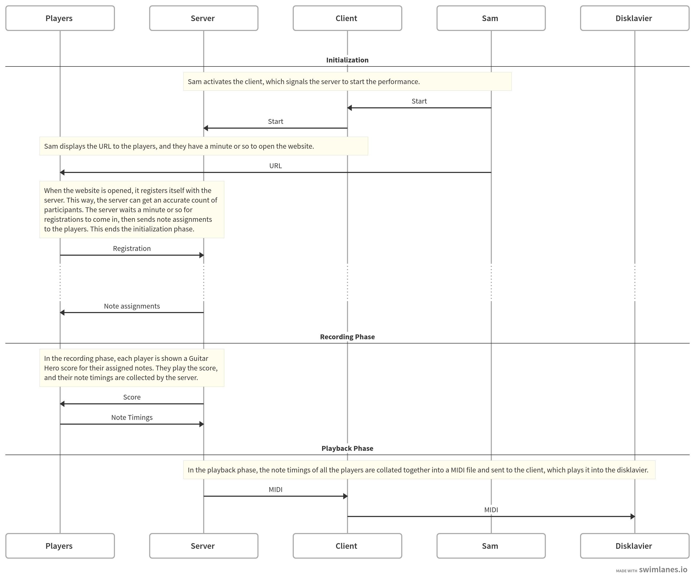
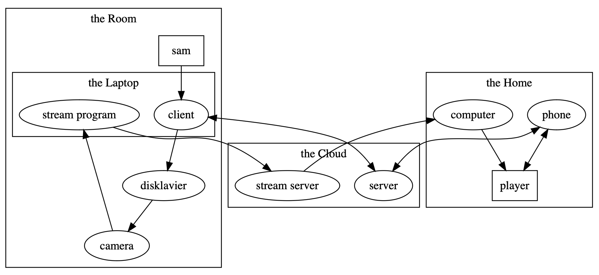

# Life Online (Piano Telephone)

A submission by [Andrew Monks][me] for [_Piano, Alone in a Room: Translating/Transcoding_][call].

[me]: https://monks.co
[call]: https://docs.google.com/document/d/13bX58CqNuS43leFi2C0TOePTz89e5GglPmOBu-RSdYY/edit

## Thematic Description

**These days, aren't we are all alone in a room?** Our communication--what
makes us human--is mediated through a substrate of bits, waves, and networks.
These systems translate and transcode our faces, our speech, our affect. And
the translation is imperfect! Its encoding is incomplete! It carries latency!
When our humanity is quantized, measured, made legible to the machine, we strip
away its complexity and nuance. We use media that limits our emotions to "like"
and "dislike", "thumbs up" and "thumbs down": conforming the richness of our
spirit into schema and structure.

**And yet,** these same systems enable so much: we can communicate (however
mediated) across space. We can form communities of interest, we can
collaborate, we can play. Consumers become producers. We are all agents of
cultural production: discovering, forking, contributing, remixing, archiving.
With all this creation, the artifacts of our culture drag a complected web of
provenance, layers of meaning translated through time, alternately accreting
and shedding. Ideas and memes pass through our culture like a game of
telephone, transcoded at each step.

_Life Online_ explores these themes through the lens of piano music. We present
our audience with a mediated interface to a disklavier piano: a handful of
keys. Our players, geographically and temporally distributed, participate
through this interface, collaboratively playing and recording a piano score.
Our playing fleetingly becomes physical on the disklavier, but this is just a
single moment: no human can hear it before it is captured again, transcoded
into a digital audio-video, and relayed back to us through a corporate
streaming platform.

## Subjective Description

This performance has two phases: recording and playback.

In the recording phase, the disklavier is not used. Audience members are
invited to visit a website. Two things are on the screen: a few playable piano
keys (each visitor gets a different handful of notes) and a scrolling musical
score. Together, the two parts of the interface evoke rhythm games like Guitar
Hero. The participants simultaneously play a round of Piano Hero, each playing
a different handful of notes of the same song: if Bob is assigned D4 and B♭6,
his score has only those notes, and he only sees those two keys, which he plays
at the appropriate moments. Everyone's playing is sent back to the server for
the playback phase, combining Bob's D4s and B♭6s with the input from other
players.

In the playback phase, each participant's note timings are collated together
into a single midi stream, which is sent to the disklavier, recorded, and
livestreamed back to the players, who sit and listen. Finally, a midi file is
made available for subsequent remixing.

## Material Description

This system has the following components:

- **Sam**, contrary to the first constraint of the show, is (I presume) in the
  room to switch between pieces and operate the computer plugged into the
  disklavier.
- The **Disklavier** is a Yamaha MX100 MkII Disklavier.
- The **Client** is a program which runs on the computer plugged into the
  disklavier.
- The **Server** is a program which runs "in the cloud" or something. It hosts a
  website that is accessed by the Players. It also communicates with the
  Client.
- The **Players** are the audience members slash participants. They are probably
  watching the livestream on their computers, and they are expected to interact
  with the piece on their phones.

 <!-- https://swimlanes.io/#bVRBjtswDLz7FTwHrh+QQy9doA3QFovsFj0WXJmJiVUkQ1JipK8vKcmuY+wpEM0ZDodkfOgp7OHZ4p1CbOF58I7k94XCjUILXyyTS/LGSwtPHN8t3phC0/zZw253cJwYLf/FxN7tdk3jfKIZLJi9AgFN4hsmipAGAlMpp4HNAJHPDm35EjMOkoeYMKQcGymcfLigM9RB0yjdp89VlrBrXlNeGi+V53hRM/e2YISi5zhKuJT9dfyuNXO12Qd0vQbuMOCNAOHC7ipcPkD0muxHchkx0VvkRN0irZbbK+1Gwazu9/AIBo6ZkPoWOEGgM8ckAHlEsieYOA0rgzp4HQQx4b1d22bQwZmSSBfDzTWI4WD8VYzxJxjFDzY8oktR8QtqQimybVAcrypCnmzUlo2/iFKXazqBuz5Cbg+jDvEi5saNj1VpTtUwP+wLjANGda76sx7gcVW9aZqu6/bicJG8NvnnRoDkltU8kvGhZ3eWlZYqy25uZ3EokwhLehbVAqEsZ2lDxxMHP4mv8PXKslrwjYIsqUAoeyUMHKoM6rMrxeV7pihT0uxlsSQ9y0ksxp9lAEGHZS2ZJARv9/W4P2z8Rek+ci478lpoqxea9YbmfWNFPdP/V724Mc6AaobGHuTKRqG161EvHaA2kLxs4qDWOdkIhB+HpwOc2FLuP+q11k15/DcoRyk3kHH6vV/UPfgwH7MSr+5/3YvW/Ac= -->

If we zoom out and consider a larger system, we can introduce some more
components:

- A **Camera** is pointed at the disklavier and plugged into Sam's Laptop.
- A **Stream Program** is running on Sam's Laptop, capturing and streaming
  video from the camera.
- A **Stream Server** is running in the cloud, hosted by (eg) Twitch, receiving
  and distributing video from the Stream Program.
- **Computers** in front of the Players receive and display video from the
  Stream Server

If we tease the system apart, we see that it is a circle, which is always
significant.

## Technical Details

### Duration

The duration is a bit variable, but we can estimate it as follows:

1. We'll allow a couple minutes for folks to open the website so that we can
   get an accurate participant count and assign notes.
2. The score should be 1 to 3 minutes in length, so that's how long the
   recording phase will take, plus a minute or so of padding to allow folks
   time to read the instructions and complete the activity at their own pace.
3. The playback phase is the same length as the score: 1 to 3 minutes

Together, that's a minimum of, let's say, 6 minutes.

I think it would be fun to do two scores: an easy demo (Happy Birthday, say) so
that folks can get their bearings and understand what's going on, followed by
some famously difficult section of a well-known work for piano.

If we imagine that the easy demo is 1 minute and the difficult piece is 3
minutes, that takes us to a total of no more than 15 minutes.

### Client Requirements

If you're comfortable with running programs in the terminal, I'd prefer to
provide the client as a single MacOS executable universal binary with no
dependencies. If that's uncomfortable, I can instead provide a website url, but
that's a bit more work on my end.

If there are multiple midi output ports, the client may list their names and
prompt you to choose the disklavier.

### Visual Element

The piece requires directing audience members to a website, so that direction
is my visual element. If you'd like, I can make the client throw up a window
with for you to display on the stream. Alternately, and I suspect this will be
easier for your workflow, you can display the URL via whatever mechanism you're
using for other visual elements.

## Artist Bio

[Andrew Monks][me] makes networked systems in Chicago. Previously, he brought
artists' practices to industry, helping build an IoT network connecting the
millions of trucks and drivers that are America's nervous system. Now, he
brings industry's practices to the arts, building critical information systems
like this one.
